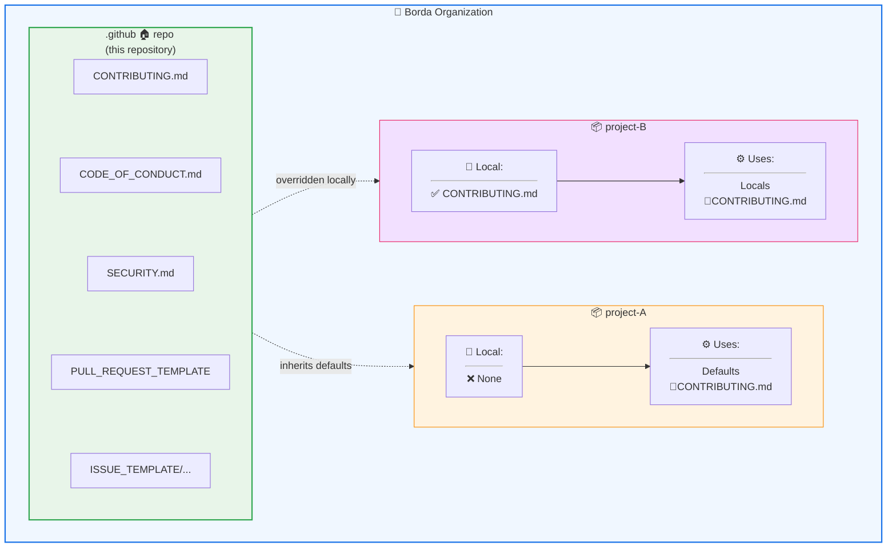

# 🏠 Borda's Default GitHub Configuration

[](https://results.pre-commit.ci/latest/github/Borda/.github/main)
[](https://github.com/Borda/.github/actions/workflows/check-md-link.yaml)

> 💡 **One configuration to rule them all** — Shared defaults for all Borda repositories.

This repository contains **organization-wide default configurations** for all Borda GitHub projects. These files are automatically inherited by any repository that doesn't define its own versions, reducing duplication and ensuring consistency across the organization.

## 🎯 Purpose & Motivation

Managing community health files across multiple repositories can be tedious and error-prone. This `.github` repository solves that by providing:

- **Centralized defaults** — Define once, apply everywhere
- **Consistent contributor experience** — Same guidelines, templates, and expectations across all projects
- **Reduced maintenance** — Update one file to affect all repositories
- **Quick project bootstrapping** — New repositories immediately inherit best practices

**When does this matter?** For small projects or those just starting out, having individual configuration files is often overkill. These defaults provide a solid foundation until a project grows large enough to require customization.

> ⚠️ **Important for forked repositories**: If you fork one of Borda's repositories, these defaults from the organization `.github` will **not** be honored because your fork is no longer part of the Borda organization. You'll need to either:
>
> 1. Copy the files you need into your forked repository, or
> 2. Create your own organization's `.github` repository (see [Using This as Your Template](#-using-this-as-your-template) below)

## 📦 What's Included

| File                                                           | Description                                      |
| -------------------------------------------------------------- | ------------------------------------------------ |
| [`CONTRIBUTING.md`](.github/CONTRIBUTING.md)                   | Guidelines for contributing to any Borda project |
| [`CODE_OF_CONDUCT.md`](.github/CODE_OF_CONDUCT.md)             | Community standards and enforcement ladder       |
| [`SECURITY.md`](.github/SECURITY.md)                           | Security policy and vulnerability reporting      |
| [`PULL_REQUEST_TEMPLATE.md`](.github/PULL_REQUEST_TEMPLATE.md) | Default PR template with checklist               |
| [`ISSUE_TEMPLATE/...`](.github/ISSUE_TEMPLATE/)                | Bug report and feature request templates         |

## 🔄 How GitHub Inheritance Works

GitHub automatically uses files from this `.github` repository as **fallback defaults** for any repository in the organization that doesn't have its own version. This is built into GitHub's [community health files](https://docs.github.com/en/communities/setting-up-your-project-for-healthy-contributions/creating-a-default-community-health-file) feature.



**Official Documentation:**

- [Creating default community health files](https://docs.github.com/en/communities/setting-up-your-project-for-healthy-contributions/creating-a-default-community-health-file)
- [About community profiles for public repositories](https://docs.github.com/en/communities/setting-up-your-project-for-healthy-contributions/about-community-profiles-for-public-repositories)

### Key Behaviors

1. **Automatic fallback**: If a repo doesn't have `CONTRIBUTING.md`, GitHub shows the one from `.github`
2. **Local wins**: A project-specific file **always overrides** the default
3. **Partial override**: Override only what you need — other defaults remain active
4. **Transparent to users**: Contributors see the files seamlessly, regardless of source

## 🎯 When to Use Defaults vs. Override

### ✅ Use the Defaults When

- Starting a **new project** that follows standard Borda practices
- Your project has **no unique contribution requirements**
- You want to **minimize maintenance** overhead
- The project is **small or experimental**

### 🔧 Override When

- Your project has **language-specific setup** (e.g., Python virtualenv, Rust cargo)
- You need **custom issue templates** (e.g., ML model bug report with GPU info)
- The project has **different branching strategies**
- You need **project-specific security policies**

## 📝 How to Override Configuration

> 💡 **Remember this section** when you need custom configuration for a specific project.

To override any default file, simply create the same file in your repository. GitHub will automatically use your local version instead.

### Example: Custom Contributing Guide

Create `.github/CONTRIBUTING.md` in your repository root with project-specific setup:

```markdown
# Contributing to My-Awesome-Project

## Setup

    pip install -e ".[dev]"
    pre-commit install

## Running Tests

    ...
```

### Example: Custom Issue Templates

Create `.github/ISSUE_TEMPLATE/` directory with your templates:

```
your-repo/
├── .github/
│   └── ISSUE_TEMPLATE/
│       ├── bug_report.md      # Overrides default
│       ├── feature_request.md # Overrides default
│       └── ml_model_issue.md  # New template (additive)
```

### Example: Override AGENTS.md

For projects with specific AI agent requirements, create `.github/AGENTS.md`:

```markdown
# Project-Specific Agent Configuration

> This extends the [organization defaults](https://github.com/Borda/.github/blob/main/AGENTS.md)

## Additional Rules for This Project

- Use `poetry` instead of `pip` for dependency management
- Run `make lint` before committing
- GPU tests require the `@pytest.mark.gpu` decorator
```

### Partial Override Strategy

You don't need to duplicate everything. Reference the defaults and add only what's different:

```markdown
# Contributing to ML-Pipeline

Please follow [Borda's general contributing guidelines](https://github.com/Borda/.github/blob/main/.github/CONTRIBUTING.md).

## Additional Setup for This Project

    conda install pytorch torchvision -c pytorch
```

## 🧠 Understanding AGENTS.md

The [`AGENTS.md`](AGENTS.md) file defines standards for AI coding assistants (GitHub Copilot, Claude, Cursor, etc.) working on Borda projects. It establishes:

- **Agent roles** (SW Engineer, QA Specialist, Squeezer, Doc-Scribe, Mentor-Bot)
- **Documentation protocol** (6-point structure for all public APIs)
- **Testing standards** ("The Borda Standard" for rigorous testing)
- **Security protocols** and **error handling** best practices

> ⚠️ **Important:** Unlike other community health files (`CONTRIBUTING.md`, `CODE_OF_CONDUCT.md`, etc.), `AGENTS.md` is **not** automatically inherited by other repositories in the organization. According to [GitHub's documentation on community health files](https://docs.github.com/en/communities/setting-up-your-project-for-healthy-contributions/creating-a-default-community-health-file#supported-file-types), only specific file types are supported for automatic inheritance. To use `AGENTS.md` in other projects, you must:
>
> 1. **Copy it to each repository** where you want AI agents to follow these standards, or
> 2. **Reference it in your AI tool's custom instructions** (e.g., Cursor, Windsurf, GitHub Copilot Workspace)
> 3. **Include it in your IDE/editor configuration** if your tool supports organization-wide settings

## 🛠️ Maintenance

This repository is maintained by the Borda organization. Changes here affect **all repositories without local overrides**, so modifications are reviewed carefully.

### Proposing Changes

1. **Open an issue** describing the proposed change
2. **Discuss impact** — changes affect many projects
3. **Submit PR** with clear rationale
4. **Get approval** from organization maintainers

### Versioning Strategy

This repository follows **rolling updates**. All changes are immediately reflected in projects using defaults. For breaking changes:

1. Announcement in discussions/issues
2. Grace period for projects to override if needed
3. Implementation of the change

## 🌍 Using This as Your Template

This repository is open source and can serve as a template for your own organization or personal defaults! You're welcome to fork it and adapt it to your needs.

### How to Use This for Your Organization/Projects

1. **Create a `.github` repository** in your organization (or personal account)
2. **Fork or copy** the files from this repository
3. **Customize** the content to match your organization's standards
4. **Commit and push** — your repositories will automatically inherit these defaults

### Guidelines for Forking

- **Maintain attribution**: If you use significant portions of these templates, please include a note acknowledging the source
- **Share improvements**: If you make improvements or find better patterns, consider opening a PR — I'm happy to incorporate community feedback!
- **Adapt freely**: Adjust to your language, framework, or team preferences

**Example acknowledgment:**

```markdown
<!-- In your CONTRIBUTING.md or README.md -->
> This project's community health files were inspired by [Borda's defaults](https://github.com/Borda/.github).
```

## 🤝 Contributing to These Defaults

I'm committed to continuously improving these defaults and **I welcome contributions**! If you have:

- Better templates or workflows
- Clearer wording or examples
- Additional best practices
- Fixes for issues

Please open a PR or issue. Improvements here benefit the entire Borda organization and anyone else using these as a template.

## 📚 Related Resources

- [GitHub: Creating default community health files](https://docs.github.com/en/communities/setting-up-your-project-for-healthy-contributions/creating-a-default-community-health-file)
- [GitHub: About community profiles](https://docs.github.com/en/communities/setting-up-your-project-for-healthy-contributions/about-community-profiles-for-public-repositories)
- [Contributor Covenant](https://www.contributor-covenant.org/) — basis for our Code of Conduct

______________________________________________________________________

<div align="center">

**Questions?** Open an [issue](https://github.com/Borda/.github/issues) or start a [discussion](https://github.com/Borda/.github/discussions).

Made with 💙 by the Borda et al.

</div>
